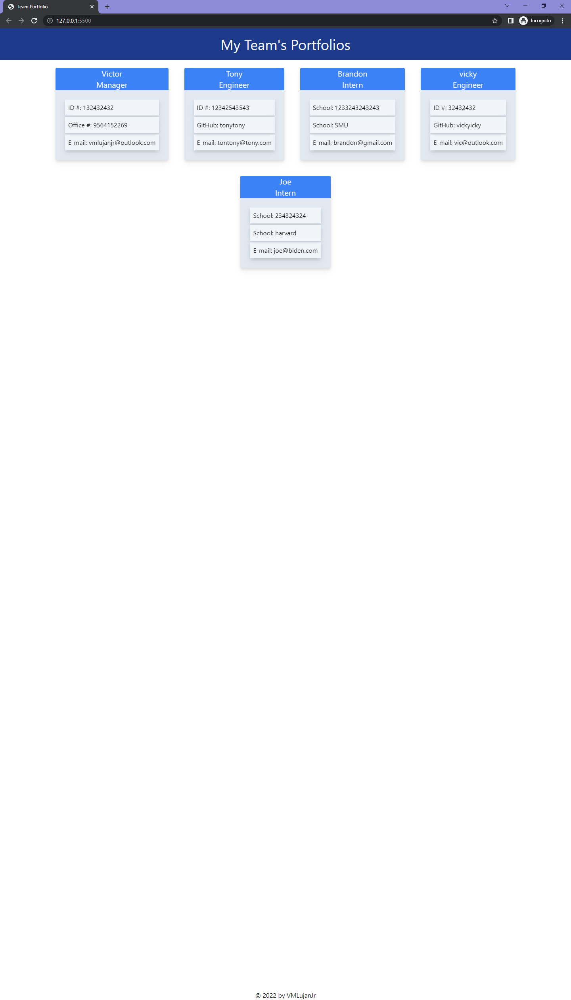

# Employee-Profile

## Description

Welcome to the Employee-Profile project!

A Node.js command-line application that takes information about employees on a software engineering team and generates an HTML webpage that displays summarys for each person

You may visit the deployed [website](https://VMLujanJr.github.io/employee-profile/) to try it out for yourself!

## Table of Contents

- [Employee-Profile](#employee-profile)
  - [Description](#description)
  - [Table of Contents](#table-of-contents)
  - [User Story](#user-story)
  - [Acceptance Criteria](#acceptance-criteria)
  - [Mock-up](#mock-up)
  - [Technologies](#technologies)
  - [Installation](#installation)
  - [Usage](#usage)
  - [Contributing](#contributing)
  - [Tests](#tests)
  - [Questions](#questions)
  - [License](#license)
  - [Extra Information](#extra-information)

## User Story

~~~
AS A manager
I WANT to generate a webpage that displays my team's basic info
SO THAT I have quick access to their emails and GitHub profiles
~~~

## Acceptance Criteria

~~~
GIVEN a command-line application that accepts user input
~~~

- [x] WHEN I am prompted for my team members and their information
~~~
THEN an HTML file is generated that displays a nicely formatted team roster based on user input
~~~

- [x] WHEN I click on an email address in the HTML
~~~
THEN my default email program opens and populates the TO field of the email with the address
~~~

- [x] WHEN I click on the GitHub username
~~~
THEN that GitHub profile opens in a new tab
~~~

- [x] WHEN I start the application
~~~
THEN I am prompted to enter the team manager's name, employee ID, email address, and office number
~~~

- [x] WHEN I enter the team manager’s name, employee ID, email address, and office number
~~~
THEN I am presented with a menu with the option to add an engineer or an intern or to finish building my team
~~~

- [x] WHEN I select the engineer option
~~~
THEN I am prompted to enter the engineer’s name, ID, email, and GitHub username, and I am taken back to the menu
~~~

- [x] WHEN I select the intern option
~~~
THEN I am prompted to enter the intern’s name, ID, email, and school, and I am taken back to the menu
~~~

- [x] WHEN I decide to finish building my team
~~~
THEN I exit the application, and the HTML is generated
~~~

## Mock-up

## Technologies
HTML, CSS, Markdown, JavaScript, Node.js, Jest, Inquirer

## Installation

VSCode

## Usage

Please use this [video](https://drive.google.com/file/d/1y-zzffdqEfttWwcFoLaSlIKfW6oH_2b-/view) to learn how to start the application.

## Contributing

Contribute

## Tests

Test

## Questions

If you have any questions, you may direct them to VMLujanJr using the following links:

| Contact | Description |
| --- | --- |
| Name | Victor |
| Occupation | Developer |
| E-mail | <vmlujanjr@outlook.com> |
| GitHub | <https://github.com/VMLujanJr/> |

## License

MIT License

Copyright (c) 2022 Victor

Permission is hereby granted, free of charge, to any person obtaining a copy
of this software and associated documentation files (the "Software"), to deal
in the Software without restriction, including without limitation the rights
to use, copy, modify, merge, publish, distribute, sublicense, and/or sell
copies of the Software, and to permit persons to whom the Software is
furnished to do so, subject to the following conditions:

The above copyright notice and this permission notice shall be included in all
copies or substantial portions of the Software.

THE SOFTWARE IS PROVIDED "AS IS", WITHOUT WARRANTY OF ANY KIND, EXPRESS OR
IMPLIED, INCLUDING BUT NOT LIMITED TO THE WARRANTIES OF MERCHANTABILITY,
FITNESS FOR A PARTICULAR PURPOSE AND NONINFRINGEMENT. IN NO EVENT SHALL THE
AUTHORS OR COPYRIGHT HOLDERS BE LIABLE FOR ANY CLAIM, DAMAGES OR OTHER
LIABILITY, WHETHER IN AN ACTION OF CONTRACT, TORT OR OTHERWISE, ARISING FROM,
OUT OF OR IN CONNECTION WITH THE SOFTWARE OR THE USE OR OTHER DEALINGS IN THE
SOFTWARE.

## Extra Information

~~~
.
├── __tests__/             //jest tests
│   ├── Employee.test.js
│   ├── Engineer.test.js
│   ├── Intern.test.js
│   └── Manager.test.js
├── dist/                  // rendered output (HTML) and CSS style sheet      
├── lib/                   // classes
├── src/                   // template helper code 
├── .gitignore             // indicates which folders and files Git should ignore
├── index.js               // runs the application
└── package.json           
~~~